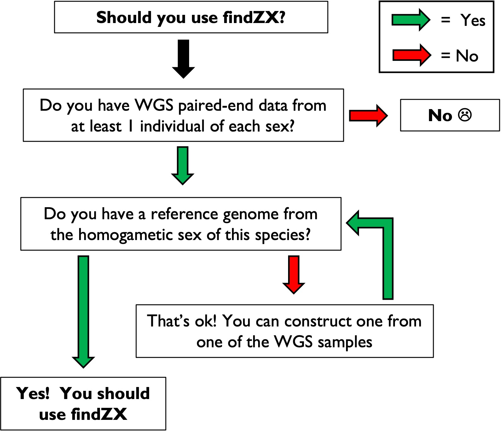

# XYZWfinder

**A snakemake-based pipeline for identifying sex chromosomes using whole-genome sequencing (WGS) paired-end data from males and females**

Use this flowchart to find out if you should use XYZWfinder: 
<p align="center"></p>

***


## Table of contents
1. [Introduction](#introduction)
2. [Installation](#installation)
3. [Example usage (test dataset)](#test)
4. [Using the XYZWfinder workflow](#usage)
5. [Run the pipeline](#third-example)
6. [Known issues](#issues)
7. Making a reference genome
8. [Output](#fourth-examplehttpwwwfourthexamplecom)


## Introduction <a name="introduction"></a>
Sex chromosomes have evolved numerous times across the tree of life, as revealed by recent genomic studies of non-model organisms. However, much of the sex chromosome diversity remains undiscovered. Identifying sex chromosomes in more species is crucial for improving our understanding of why and how they evolve, and to avoid misinterpreting genomic patterns caused by undetected sex chromosome variation. 

XYZWfinder is an automated Snakemake-based computational pipeline, designed to detect and visualize sex chromosomes through differences in genome coverage and heterozygosity between males and females. It is user-friendly and scalable to suit different computational platforms, and works with any number of male and female samples. 

The pipeline can be deployed using two different scripts (see below for details). With the basic script (**XYZWfinder-no-synteny**), WGS reads from samples are trimmed and aligned to a reference genome (which can be generated from the WGS data if no reference genome for the study species is available). This is followed by calculations of sex-specific genome coverage and heterozygosity statistics for each chromosome/scaffold in the reference genome, as well as across genome windows of modifiable sizes (e.g. 100 kb and 1 Mb windows). The other script (**XYZWfinder-synteny**) includes an additional step: a genome coordinate lift-over to a reference genome of another species. This allows users to inspect sex-linked regions over larger contiguous chromosome regions, while also providing between-species synteny information.


***    

## Installation <a name="installation"></a>

XYZWfinder works on Linux and macOS systems, and contains a configuration file which can be used to run the pipeline on a SLURM system. The only prerequisite (except for XYZWfinder itself) is that [conda](https://docs.conda.io/en/latest/) (or anaconda/mamba) is installed on the system. Once installed (see  installation guide [here](https://docs.conda.io/projects/conda/en/latest/user-guide/index.html)), conda will download all other dependencies automatically. 

### Obtain a copy of XYZWfinder by cloning this GitHub repository:

    git clone https://github.com/hsigeman/XYZWfinder.git
    cd XYZWfinder # Go to directory

### Use conda to install the needed software. There are two ways to do this: 

#### Option 1 (recommended): Create a minimal conda environment and install software automatically through XYZWfinder

Enter this code to create a minimal conda environment:
 
    conda create -n snakemake_basic -c conda-forge -c bioconda python=3.9.4 snakemake-wrapper-utils=0.2.0 snakemake=6.4.0

*-n* specifies the name of the conda environment (snakemake_basic). This can be changed to another string.

*-c* specifies the needed conda channels

*python* specifies the python version (need to be >3.9)

*snakemake-wrapper-utils* installs tools needed to use [Snakemake wrappers](https://snakemake-wrappers.readthedocs.io/en/stable/)

*snakemake* installs snakemake (tested on version 6.4.0)

If this installation option is used, add the flag **"--use-conda"** when launching XYZWfinder. All needed software will then be automatically downloaded and installed into separate conda environments for different parts of the pipeline (thus minimizing the risks of conflicts between software).

Then activate the environment: 

    conda activate snakemake_basic

#### Option 2: Install all software dependencies into a single conda environment

The provided conda environment file (environment.yml) can also be used to install all needed software directly: 

    conda env create -f environment.yml # This will create a conda environment called XYZWfinder
    conda activate XYZWfinder # Activate the conda environment

If this option is used, omit **"--use-conda"** when launching XYZWfinder.

***

## Example usage (test dataset) <a name="test"></a>

Next, we will use the XYZWfinder pipeline to analyse a small test dataset. This is (a) to make sure that all programs are correctly installed, but also (b) to show how to use the program. 

With the test dataset, we will identify sex-linked regions in the [mantled howler monkey](https://en.wikipedia.org/wiki/Mantled_howler), using small subsets of the following files (all located in ./test/Example): 

- WGS reads from 2 female ([SRR9655168](https://www.ncbi.nlm.nih.gov/sra/SRR9655168), [SRR9655169](https://www.ncbi.nlm.nih.gov/sra/SRR9655169)) and 2 male ([SRR9655170](https://www.ncbi.nlm.nih.gov/sra/SRR9655170), [SRR9655171](https://www.ncbi.nlm.nih.gov/sra/SRR9655171)) mantled howler monkeys
- [Mantled howler monkey reference genome](https://www.ncbi.nlm.nih.gov/assembly/GCA_004027835.1/) (AloPal_v1_subset.fasta)
- [Human reference genome](https://www.ncbi.nlm.nih.gov/assembly/GCF_000001405.39) (Homo_sapiens.GRCh38_subset.fasta)

To run **XYZWfinder** (using only the mantled howler monkey reference genome), run this code: 

    snakemake -s workflow/snakefile-no-synteny --configfile config/config.yml --cores 1 -R all -k --use-conda

*-R* specifies which rule to re-run, in this case it is rule all which specifies all desired output files.

*-k* specifies that other jobs should continue even if one job fails. Can be omitted. 

*--configfile* specifies the configuration file where data paths and settings are listed


To run **XYZWfinder-synteny** (where the data will be lifted-over to genome positions in the human reference genome), run this code: 

    snakemake -s workflow/snakefile-synteny --configfile config/config.yml --cores 1 -R all -k --use-conda

#### Output format

The output is stored under results/AloPal_test:

```
tree -d results/AloPal_test/
├── coverage 
├── logs 
│   ├── bamtools
│   ├── bwa_mem
│   ├── fastqc
│   ├── freebayes
│   ├── picard
│   │   └── dedup
│   ├── samtools
│   └── samtools_stats
├── output # <-- This directory is where all the final output is stored
│   ├── no_synteny # <-- Results using the XYZWfinder option
│   │   ├── plots
│   │   └── tables
│   └── synteny # <-- Results using the XYZWfinder-synteny option
│       └── HS # ("HS" stands for Homo sapiens; see config.yaml file)
│           ├── plots
│           └── tables
├── qc # Quality control output
│   ├── dedup
│   └── fastqc
│       ├── multiqc.trimmed_data
│       └── multiqc.untrimmed_data
├── synteny_lastal 
│   └── HS
└── variant_calling 
```

#### Stop XYZWfinder after trimming to inspect the trimming results

In this example, we ran the entire pipeline from start to finish in one go. When working on a new dataset, however, it is a good idea to inspect the success of the trimming before continuing. XYZWfinder can do that. To start over again, delete the directory with the results from the test dataset:

    rm -r results/AloPal_test

Then, rerun only the trimming step using this command: 

    snakemake -s workflow/snakefile-{synteny/no-synteny} --configfile config/config.yml -k --cores 1 --use-conda -R multiqc_stop --notemp

*-R multiqc_stop* tells snakemake to stop the pipeline after trimming and quality control

*--notemp* this flag prevents deletion of intermediate files that would otherwise have been deleted (to save space)

Once the pipeline has finished, open the following files to inspect if the trimming was successful: 

    results/AloPal_test/qc/fastqc/multiqc.untrimmed_data
    results/AloPal_test/qc/fastqc/multiqc.trimmed_data

If it was not, the trimming settings can be changed in the configuration file (config/config.yaml). If it was, start the pipeline again using the normal command (as above): 

    snakemake -s workflow/snakefile-{synteny/no-synteny} --configfile config/config.yml --cores 1 -R all -k --use-conda

### Output plots and HTML report
All output plots are multi-page PDF files, where the last page also contain a figure legend and paths to tables used to generate each plot. 

To render an interactive HTML report for all output plots (with longer descriptions of each plot), use this command: 

    snakemake -s workflow/snakefile-no-synteny --configfile config/config.yml --cores 1 -R all -k --use-conda --report report.html
    snakemake -s workflow/snakefile-synteny --configfile config/config.yml --cores 1 -R all -k --use-conda --report report_synteny.html

Open the files "report.html" and "report_synteny.html" to check out the reports. 


***

## Using the XYZWfinder workflow <a name="usage"></a>

Once the software are [installed](#installation) and [verified](#test), you can run XYZWfinder on you own dataset. To do so, carefully follow the steps outlined below. 

The directory **config/Manuscript_data** contain configuration files used to analyse data from the nine species in our [preprint](ADD LINK LATER). 

##### 1. Prepare input data 

i. Download WGS data from male and female individuals of the target species

ii. Download a reference genome from the expected homogametic sex of the target species (or construct one based on a WGS sample)

iii. If a "synteny-species" is used, download the reference genome of this species

iv. Create a tabular file (.tsv) with information about sample ID, heterogamety, and fastq.gz file paths (example: config/units.tsv)

##### 2. Create a configuration file

Use the template configuration files used for running the test dataset (config/config.yml) and edit where approriate. The configuration file must include the location of the tabular file containing information about the samples to be analysed (config/units.tsv; see above).


- **config/config.yml** # Specify paths to reference genome etc. 
- **config/units.tsv** # Sample information and paths to fastq files
- **config/chromosomes.list** # Optional: List of scaffolds/chromosomes in the reference genome to include in the final plots (with snakefile-no-synteny)
- **config/HS_chromosomes.list** # Optional: List of scaffolds/chromosomes in the synteny-species reference genome to include in the final plots (with snakefile-synteny)

The **cluster.json** file have to be edited if the pipeline will be ran on a cluster. Specify the account name. 
If a large amount of samples are used (more than 10 individuals with a genome size of 1Gbp), or an organism with a very large genome, the times and number of cores specified might have to be changed. 
 

## Run the pipeline:
The pipeline can be run with and without a synteny species. Choose the snakefile with the corresponding name (snakefile-synteny or snakefile-no-synteny).
    
The first step of the pipeline is optional trimming of all samples, with fastqc and multiqc being run on the samples before and after trimming. To only run this part of the pipeline (if TRIM_SAMPLES in the config file is set to "TRUE"), run the pipeline like this: 

    snakemake -s workflow/snakefile-{synteny/no-synteny} --configfile config/config.yml -k --cores {N} --use-conda --conda-frontend mamba -R multiqc_stop --notemp

If the multiqc report shows that the trimming was successful (or if trimming is not needed), run the pipeline again with this command:

    snakemake -s workflow/snakefile-{synteny/no-synteny} --configfile config/config.yml -k --cores {N} --use-conda --conda-frontend mamba -R all


If the pipeline is run on a server cluster (e.g. SLURM), a configuration file is needed (example cluster.yaml), and the command to start the pipeline should be written like this: 

    snakemake -s workflow/snakefile-{synteny/no-synteny} -j 15 -R all --configfile config/config.yml --cluster-config cluster.yaml --cluster " sbatch -A {cluster.account} -t {cluster.time} -n {cluster.n} "
 
*-j* specifies the number of jobs that can be run simultaneously.  

Start the pipeline within a **tmux** session to ensure that the run is not stopped if you disconnect from the server (https://github.com/tmux/tmux/wiki):

    tmux new -s <name_of_session>


If the reference genome used is constructed from one of the individuals in the analysis, this can introduce noise from reference bias in the results, especially if the organism has a very variable genome. This can be solved by creating a consensus genome. This can be done by running the pipeline like this:
 
    snakemake -s snakefile-{synteny/no-synteny} -j 15 reference/genome/directory/{name_of_reference}_nonRefAf_consensus.fasta --configfile config.txt --cluster-config cluster.json --cluster " sbatch -A {cluster.account} -t {cluster.time} -n {cluster.n} "
 
This will produce a consensus genome in the same directory as the reference genome, named the same as the reference genome with *'_nonRefAf_consensus'* added before the *'.fasta'* sufix. The whole pipeline can then be re-run with the new consensus genome. Remember to change the config-file to specify this new reference genome and re-run the pipeline as above. The consensus genome can be created before running the whole pipeline, or after. If it is run before, no flagstat-files will be created since they are only specified in the rule all and here we only specify to create the consensus genome, not the files in rule all.


## Known issues <a name="issues"></a>

When using tmux to run the pipeline, make sure that the conda environment version of Python is loaded (Python 3.9.4) with the following command: 

    python -V # Should give: "Python 3.9.4"


 
## Output
The result is shown in figures in the *figures/* folder.   
 

# Reference
Sigeman, H., Ponnikas, S. & Hansson, B. Whole-genome analysis across 10 songbird families within Sylvioidea reveals a novel autosome-sex chromosome fusion. Biol. Lett. 16, 20200082 (2020).

## Authors
- Hanna Sigeman (hanna.sigeman@biol.lu.se)
- Bella Sinclair (bella.sinclair@biol.lu.se)
