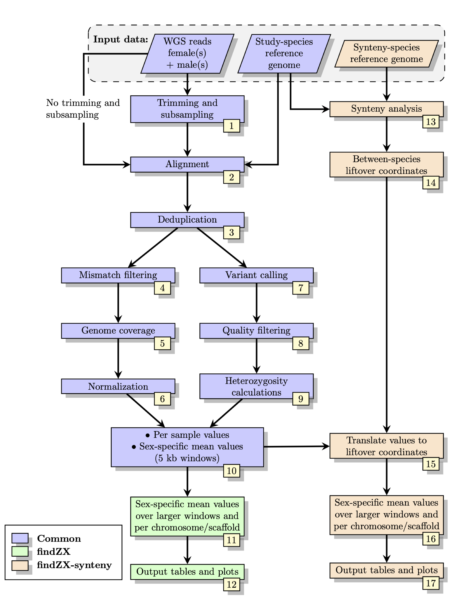

# findZX

**A snakemake-based pipeline for identifying sex chromosomes using whole-genome sequencing (WGS) paired-end data from males and females**

***


## Table of contents
1. [Introduction](#introduction)
2. [Installation](#installation)
3. [Basic usage - Example using a test dataset](#test)
4. [Basic usage - Configure findZX to your own dataset](#usage)
5. [Run the pipeline on a SLURM system](#server)
6. [Known issues](#issues)
7. [Constructing a de novo reference genome](#denovo)


## Introduction <a name="introduction"></a>
FindZX is a Snakemake-based pipeline which detects and visualizes sex chromosomes through differences in genome coverage and heterozygosity between males and females. It is user-friendly and scalable to suit different computational platforms, and works with any number of male and female samples. 

The pipeline can be deployed using two different scripts (see below for details). With the basic script (**findZX**), WGS reads from samples are trimmed and aligned to a reference genome (which can be generated from the WGS data if no reference genome for the study species is available). This is followed by calculations of sex-specific genome coverage and heterozygosity statistics for each chromosome/scaffold in the reference genome, as well as across genome windows of modifiable sizes (e.g. 100 kb and 1 Mb windows). The other script (**findZX-synteny**) includes an additional step: a genome coordinate lift-over to a reference genome of another species. This allows users to inspect sex-linked regions over larger contiguous chromosome regions, while also providing between-species synteny information.

<div align="center">
<p align="center"></p>

Flowchart showing the main computational steps of findZX/findZX-synteny

</div>

***    

## Installation <a name="installation"></a>

FindZX works on Linux and macOS systems, and contains a configuration file which can be used to [run the pipeline on a SLURM system](#server). There is only one prerequisite (except for findZX itself): that [conda](https://docs.conda.io/en/latest/) is installed on the system. Conda (see installation guide [here](https://docs.conda.io/projects/conda/en/latest/user-guide/index.html)) will then download and install all other dependencies automatically. 

Follow the steps below to download findZX and install the needed dependencies. We strongly recommend users to go through the tutorial in the next section ([Basic usage - Example using a test dataset](#test)), to verify the installation and for learning how to use findZX. 


### Obtain a copy of findZX by cloning this GitHub repository:

    git clone https://github.com/hsigeman/findZX.git
    cd findZX # Go to directory

### Use conda to install the needed software.

#### Create a minimal conda environment and install software automatically through findZX

Enter this code to create a minimal conda environment:
 
    conda create -n findZX -c conda-forge -c bioconda python=3.9.4 snakemake-wrapper-utils=0.2.0 snakemake=6.4.0 mamba=0.15.3

*-n* specifies the name of the conda environment (findZX). This can be changed to another string.

*-c* specifies the needed conda channels

*python=3.9.4* specifies the python version (need to be >3.9)

*snakemake-wrapper-utils=0.2.0* installs tools needed to use [Snakemake wrappers](https://snakemake-wrappers.readthedocs.io/en/stable/)

*snakemake=6.4.0* installs snakemake

*mamba=0.15.3* installs mamba

When launching findZX for the first time (using the flag **"--use-conda"**), all needed software will be donwloaded and installed into separate conda environments for different parts of the pipeline (thus minimizing the risks of conflicts between software).

Then activate the environment: 

    conda activate findZX

***

## Basic usage - Example using a test dataset <a name="test"></a>

In this section we will analyse a small test dataset using findZX. This is (a) to make sure that all programs are correctly installed, but also (b) to show how to use the program. These analyses should be quick (~2 minutes), but the first time you run them it will take a bit longer due to software installations. 

FindZX is a pipeline based on [snakemake](https://snakemake.readthedocs.io/en/stable/), where each analysis step is written as a separate "rule". By specifying what input data we want to use, and what "rules" we want to run, snakemake will automatically create the desired output. If you delete a file and run findZX again, only the rules needed to re-create that missing file as well as the downstream output files will be executed. 

### Data

In this example, we will identify sex-linked regions in the [mantled howler monkey](https://en.wikipedia.org/wiki/Mantled_howler) using small subsets of the following files (all located in ./.test): 

- WGS reads from 2 female ([SRR9655168](https://www.ncbi.nlm.nih.gov/sra/SRR9655168), [SRR9655169](https://www.ncbi.nlm.nih.gov/sra/SRR9655169)) and 2 male ([SRR9655170](https://www.ncbi.nlm.nih.gov/sra/SRR9655170), [SRR9655171](https://www.ncbi.nlm.nih.gov/sra/SRR9655171)) mantled howler monkeys
- [Mantled howler monkey reference genome](https://www.ncbi.nlm.nih.gov/assembly/GCA_004027835.1/) (AloPal_v1_subset.fasta)
- [Human reference genome](https://www.ncbi.nlm.nih.gov/assembly/GCF_000001405.39) (Homo_sapiens.GRCh38_subset.fasta)


### Run analyses

Before starting analyses, make sure that you have activated the conda environment. Also, make sure that the correct python version is active: 

    conda activate findZX
    python -V # Should give Python 3.9.4

#### findZX

To run **findZX** (using only the mantled howler monkey reference genome), run this code: 

    snakemake -s workflow/findZX --configfile .test/config.yml --cores 1 -R all --use-conda -k 


*--configfile* specifies the [configuration file](#test_config) where data paths and settings are listed

*--cores* specifies the maximum number of threads snakemake is allowed to use. For the test dataset, 1 core is enough. For analyses of larger datasets you will want to modify this setting according to your computer specifications. 

*-R* specifies which rule to run, in this case it is rule "all" which tells snakemake to generate all findZX output files.

*-k* specifies that other jobs should continue even if one job fails. Can be omitted. 

*--use-conda* tells snakemake to install the needed software for each rule in separate conda environments (see [above](#installation))

#### findZX-synteny

To run **findZX-synteny** (where the data will be lifted-over to genome positions in the human reference genome), run this code: 

    snakemake -s workflow/findZX-synteny --configfile .test/config.yml --cores 1 -R all -k --use-conda


Did the analyses finish without errors? If so, great! If not, let us know in the Issues section of the GitHub page and we will look into it. 


### Configuration file <a name="test_config"></a>

Next, we will look at the configuration file that is needed for findZX to run (in this example we are using **.test/config.yml**). The configuration file contain information about what data and settings we want to use for our analysis. 

**Here are the most important variables in the configuration file:** 

- *run_name: howler_monkey_test_dataset*     # Specify an output directory where findZX will store the output

- *units: .test/units.tsv* # Specify the path to a tabular (tab-separated) ["unit file"](#units), containing information about the samples used for analysis

- *ref_genome: .test/AloPal_v1_subset.fasta*      # Path to the monkey reference genome

- *synteny_ref: .test/Homo_sapiens.GRCh38_subset.fasta*       # Path to the human reference genome (only used by findZX-synteny)

- *synteny_abbr: H_sapiens*      # An abbreviation for Homo sapiens (useful in case you want to use several different synteny species; only used by findZX-synteny)
 
<details>
<summary>Click here to see the entire configuration file (.test/config.yml)</summary>
<p>

```bash
## ================================= ##
## findZX config file (test dataset) ##
## ================================= ##

# Variables marked with "[findZX]" or "[findZX-synteny]" are only used when deploying 
# the pipeline with either snakefile. Other variables are used for all analyses. 

threads_max: 2
mem_max: 8000 
  # Specify maximum number of cores [threads_max] and memory [mem_max] allocation


# ============================ #
# Analysis name and input data #

run_name: howler_monkey_test_dataset 
  # Select an analysis name. Output files will be stored under "results/[run_name]"

units: .test/units.tsv
  # Path to sample information file

ref_genome: .test/AloPal_v1_subset.fasta 
  # Path to study-species reference genome (not .gz format)

synteny_ref: .test/Example/Homo_sapiens.GRCh38_subset.fasta
  # [findZX-synteny] Path to synteny-species reference genome (not .gz format)

synteny_name: H_sapiens
  # [findZX-synteny] Synteny-species name (can be any string, will be used for file and directory names)


# ================= #
# Plotting settings #

window_sizes: [25000, 50000, 100000]
  # Choose genome window sizes for plotting (as many as you want)
  # Optimal sizes depend on reference genome fragmentation and size of the sex-linked region
  # Recommended sizes to start are: [50000, 100000, 1000000] (i.e. 50 kb, 100 kb, 1Mb)

chr_file: None
  # [findZX] Specify a file with list of chromosomes to only plot these (otherwise leave as "None")

chr_highlight: [PVKV010001784.1, PVKV010001533.1]
  # [findZX] Specify chromosomes/scaffolds to highlight in plot type 4, or leave empty

synteny_chr_file: None
  # [findZX-synteny] Specify a file with list of chromosomes to only plot these (otherwise leave as "None")

synteny_chr_highlight: ["X:20513966-20718999", "3:167499270-167708345"]
  # [findZX-synteny] Specify chromosomes/scaffolds to highlight in plot type 4, or leave empty


# ================================== #
# Trimming and subsampling of reads  #

## These three variables control trimming and subsampling of reads
## Set all to "false" to disable trimming and subsampling
## Only one variable is allowed to be "true"

trim_reads: true 
  # Set to true for trimming of reads

trim_and_subsample: false
  # Set to true for trimming and subsampling of reads

subsample_only: false
  # Set to true for subsampling of reads (but not trimming)

subsample_basepairs: 1888226
  # Specify the total number of basepairs to extract from both fastq files
  # Will be used if [trim_and_subsample] or [subsample_basepairs] is set to "true"

  # Use this script to calculate expected coverage:
  # ./code/subsampling_cov_calv.sh <REF.fasta> <WANTED_COV> 


# ========================== #
# findZX-specific parameters # 
# ===== (edit if needed) ===== #
 
mismatch_settings: [0.0, 0.2]
  # Genome coverage results will be generated from the original BAM files ("unfiltered"),
  # and two other (modifiable) mismatches settings.
  # "0.0" = 0 mismatches allowed
  # "0.2" = <=2 mismatches allowed

minSizeScaffold: "10000"
  # The mimimum size of scaffolds in the reference genome to be included in the results


# ============================ #
# External software parameters # 
# ===== (edit if needed) ===== #

params:
  trimmomatic:
  # Control Trimmomatic settings here
    pe:
      trimmer:
        - "LEADING:3"
        - "TRAILING:3"
        - "SLIDINGWINDOW:4:15"
        - "MINLEN:36"
        - "ILLUMINACLIP:workflow/meta/adapters/TruSeq3-PE.fa:2:30:10"
```

</p>
</details> 


<details>
<summary>Click here to see what the "unit file" (.test/units.tsv) <a name="units"></a></summary>
<p>

| sample                | group              | fq1                                       | fq2                                       |
|-------------------    |---------------    |-----------------------------------------  |-----------------------------------------  |
| subset_SRR9655168     | homogametic       | .test/subset_SRR9655168_1.fq.gz   | .test/subset_SRR9655168_2.fq.gz   |
| subset_SRR9655169     | homogametic       | .test/subset_SRR9655169_1.fq.gz   | .test/subset_SRR9655169_2.fq.gz   |
| subset_SRR9655170     | heterogametic     | .test/subset_SRR9655170_1.fq.gz   | .test/subset_SRR9655170_2.fq.gz   |
| subset_SRR9655171     | heterogametic     | .test/subset_SRR9655171_1.fq.gz   | .test/subset_SRR9655171_2.fq.gz   |

</p>
</details> 

### Output

The output is stored under results/howler_monkey_test_dataset ("howler_monkey_test_dataset" comes from the [configuration file](#test_config)). This directory contain both intermediate files (such as BAM files and VCF files) and the final output files (tables and plots). 

When running findZX, the final output files can be found here: 
    
    ls results/howler_monkey_test_dataset/output/no-synteny/

When running findZX-synteny, the final output files can be found here: 
    
    ls results/howler_monkey_test_dataset/output/synteny/

<details>
<summary>Click to see output file structure</summary>
<p>

```
tree -d results/howler_monkey_test_dataset/
├── coverage 
├── logs 
│   ├── bamtools
│   ├── bwa_mem
│   ├── fastqc
│   ├── picard
│   │   └── dedup
│   ├── platypus
│   ├── samtools
│   ├── samtools_stats
│   ├── samtools_view
│   └── trimmomatic
├── output # <-- This directory is where all the final output is stored
│   ├── no_synteny # <-- Results using the findZX option
│   │   ├── plots
│   │   └── tables
│   └── synteny # <-- Results using the findZX-synteny option
│       └── H_sapiens # ("H_sapiens"; see config.yaml file)
│           ├── plots
│           └── tables
├── qc # Quality control output
│   ├── dedup
│   └── fastqc
│       ├── multiqc.trimmed_data
│       └── multiqc.untrimmed_data
├── synteny_lastal 
│   └── H_sapiens
└── variant_calling 
```

</p>
</details> 

#### Output plots and HTML report
All output plots are multi-page PDF files, where the last page also contain a figure legend and paths to tables used to generate each plot. 

To render an interactive HTML report for all output plots (with longer descriptions of each plot), use this command: 

    snakemake -s workflow/findZX --configfile .test/config.yml --cores 1 -R all -k --use-conda --report report.html
    snakemake -s workflow/findZX-synteny --configfile .test/config.yml --cores 1 -R all -k --use-conda --report report_synteny.html

Open the files "report.html" and "report_synteny.html" to check out the reports. 

For more information about the results, see our bioRxiv [preprint](https://www.biorxiv.org/content/10.1101/2021.10.18.464774v1). 

### Stop findZX after trimming to inspect the trimming results

In this example, we ran the entire pipeline from start to finish in one go. When working on a new dataset, however, it is a good idea to inspect the success of the trimming before continuing. FindZX can do that. To start over again, delete the directory with the results from the test dataset:

    rm -r results/howler_monkey_test_dataset

Then, rerun only the trimming and quality control steps using this command (choose findZX or findZX-synteny): 

    snakemake -s workflow/findZX{-synteny} --configfile .test/config.yml -k --cores 1 --use-conda -R multiqc_stop --notemp

*-R multiqc_stop* tells snakemake to stop the pipeline after trimming and quality control

*--notemp* this flag prevents deletion of intermediate files that would otherwise have been deleted (to save space). The trimmed fastq files are among these files that would otherwise have been deleted. 

Once the pipeline has finished, open the following files to inspect if the trimming was successful: 

    results/howler_monkey_test_dataset/qc/fastqc/multiqc.untrimmed.html
    results/howler_monkey_test_dataset/qc/fastqc/multiqc.trimmed.html

If it was not, the trimming settings can be changed in the configuration file (.test/config.yaml). If it was, start the pipeline again using the normal command (as above): 

    snakemake -s workflow/findZX{-synteny} --configfile .test/config.yml --cores 1 -R all -k --use-conda


***

## Basic usage - Configure findZX to your own dataset <a name="usage"></a>

If you haven't already done so, please take a look at the [previous section](#test) where all steps required to run findZX is explained. There, you can also take a look at the format of the [configuration file](#test_config) and [unit file](#units) needed for findZX to run. 

Additional examples of configuration and unit files are found in **config/9_species_config**. This directory contain all configuration and unit files used to analyse data from the nine species from our [preprint](https://www.biorxiv.org/content/10.1101/2021.10.18.464774v1). 

To run findZX with your own data, simply create a configuration file and a tabular unit file (see examples [above](#test)). Then start the pipeline with the following command: 

    snakemake -s workflow/findZX{-synteny} --configfile <yourConfigFile.yml> --cores <nr_of_cores> -R all -k --use-conda


#### Needed input data

- WGS data from at least 1 individual of each sex

- A reference genome from the homogametic sex of the same species (if no such reference genome is available, you can [construct one](#denovo) from the homogametic sample)

- If you want to run findZX-synteny: a reference genome of the species that will be used for genome coordinate lift-over.

#### Creating a configuration and unit file

Use the test dataset configuration file (**.test/config.yml**) or one of the configuration files in **config/9_species_config** as a template, and edit where approriate. The configuration file must include the location of the tabular unit file containing information about the samples to be analysed (see example in **.test/units.tsv** or **config/9_species_config**; see above).

Examples (these files can be located anywhere and have other names):

- **.test/config.yml** # Specify paths to reference genome etc. 
- **.test/units.tsv** # Sample information and paths to fastq files. Each sample needs to be categorized as either "homogametic" or "heterogametic". 

#### Additional (optional) files and settings

The configuration file contain some additional options which can be used to control the format of the output plots:

- *chr_file:*     # Want to plot only some chromosomes/scaffolds? If so, provide a path to a file listing these chromosomes/scaffolds here.

- *chr_highlight:*  # Want to highlight some chromosomes/scaffolds in plots? Specify these chromosomes below this line in the configuration file. Leave empty if not.

- *window_sizes:*   # List the sizes of genome windows that should be used for binning the data

- *synteny_chr_file:*   # Same as "chr_file" but for chromosomes/scaffolds in the "synteny"-reference genome

- *synteny_chr_highlight:*  # Same as "chr_highlight" but for chromosomes/scaffolds in the "synteny"-reference genome


FindZX will generate genome coverage statistics based on BAM-files that are filtered for different numbers of allowed mismatches between reads and the reference genome. Restricting the number of mismatches often lead to enhanced differences in genome coverage on the sex chromosomes but not autosomes. However, the optimal setting will vary for different species and sex chromosome systems. FindZX will generate genome coverage values for three different settings, which can be controlled with the *"mismatch_settings"* setting. Defaults (which will work for most species) are (i) 0 mismatches allowed, (ii) <=2 mismatches allowed and (iii) unfiltered. 


## Run the pipeline on a SLURM system <a name="server"></a>

If the pipeline is run on a server cluster (e.g. SLURM), a configuration file is needed (example cluster.yaml), and the command to start the pipeline should be written like this: 

    snakemake -s workflow/findZX{-synteny} -j 15 -R all --configfile .test/config.yml --cluster-config cluster.yaml --cluster " sbatch -A {cluster.account} -t {cluster.time} -n {cluster.n} "
 
*-j* specifies the number of jobs that can be run simultaneously.  

The **cluster.json** file have to be edited if the pipeline will be ran on a cluster. Most importantly, specify the account name. 

If a large amount of samples are used (more than 10 individuals with a genome size of 1Gbp), or an organism with a very large genome, the times and number of cores specified might have to be changed. 

Start the pipeline within a [tmux](#https://github.com/tmux/tmux/wiki) session to ensure that the run is not stopped if you disconnect from the server:

    tmux new -s <name_of_session>


## Known issues <a name="issues"></a>

#### Python issues when using tmux?
When using tmux to run the pipeline, make sure that the conda environment version of Python is loaded (Python 3.9.4) with the following command: 

    python -V # Should give: "Python 3.9.4"

If not, try to deactivate and activate the conda environment again. 


#### Noisy output plots?

When only using one sample of each sex, combined with a reference genome constructed from one of these samples, the genome coverage results for heavily resticted number of mismatches may be suboptimal. Especially if the organism has a very high heterozygosity. This can be solved by creating a consensus genome, incorporating variants from both samples. This can be done by running the pipeline like this:


    snakemake -s workflow/findZX{-synteny} -j 15 -R modify_genome --configfile .test/config.yml --use-conda -k
 
This will produce a consensus genome (in this directory: results/RUN_NAME/consensus_genome/), named the same as the reference genome with *'_nonRefAf_consensus'* added before the *'.fasta'* sufix. The whole pipeline can then be re-run with the new consensus genome. Remember to change the config-file to specify this new reference genome, as well as give it a new run name (to not overwrite the old analysis) and re-run the pipeline as above. The consensus genome can be created before running the whole pipeline, or after. 


#### Very long scaffolds (>512 Mb) in the reference genome

Indexing of the BAM files (using samtools index) may fail if scaffolds exceed a certain size (over 512 Mb). If you have scaffold longer than this, you can split them before starting the pipeline. Like this: 

``` 
bedtools makewindows -g reference.fasta -w 500000000 > reference.500000000.bed
bedtools getfasta -fi reference.fasta -bed reference.500000000.bed | sed 's/:/_/g' | sed 's/-/_/g' > reference.split.fasta 
```


## Constructing a de novo reference genome  <a name="denovo"></a>

If there is no reference genome availiable for the studied species, you can construct one from the WGS data of one of the homogametic samples. An example of how this can be done is the following (using [SPADES](#https://github.com/ablab/spades)): 

    spades.py -k 21,33,55,77,99,127 --pe1-1 <F_trimmed.fq.gz> --pe1-2 <R_trimmed.fq.gz> -o spades_output -t 16 -m 256


## Authors
- Hanna Sigeman (hanna.sigeman@biol.lu.se)
- Bella Sinclair (bella.sinclair@biol.lu.se)
